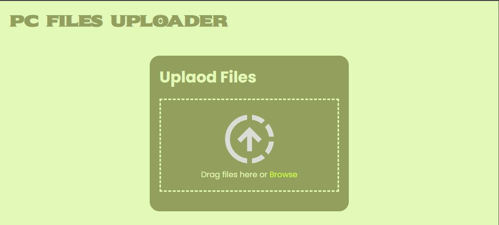

# PC File Uploader

**PC File Uploader** is a simple web-based tool that allows developers to upload files from any device connected to the same local network directly to a PC.



## Features

- Upload files locally over your router (LAN)
- No internet connection required
- Works across devices on the same network
- Lightweight and easy to use

## Tech Stack

- **Node.js** with **Express** – Server-side framework
- **Handlebars (hbs)** – Templating engine for dynamic web pages
- **Multer** – Middleware for handling file uploads

## Use Case

Ideal for developers who want to quickly transfer files from a phone, tablet, or another computer to their PC without cables, cloud services, or external storage.

## Requirements

- A PC running the server
- Devices connected to the same router/network
- A modern web browser
- Node.js installed

## Installation

1. Clone the repository:
   ```bash
   git clone https://github.com/avinashtare/pc-file-uploader
   ```
